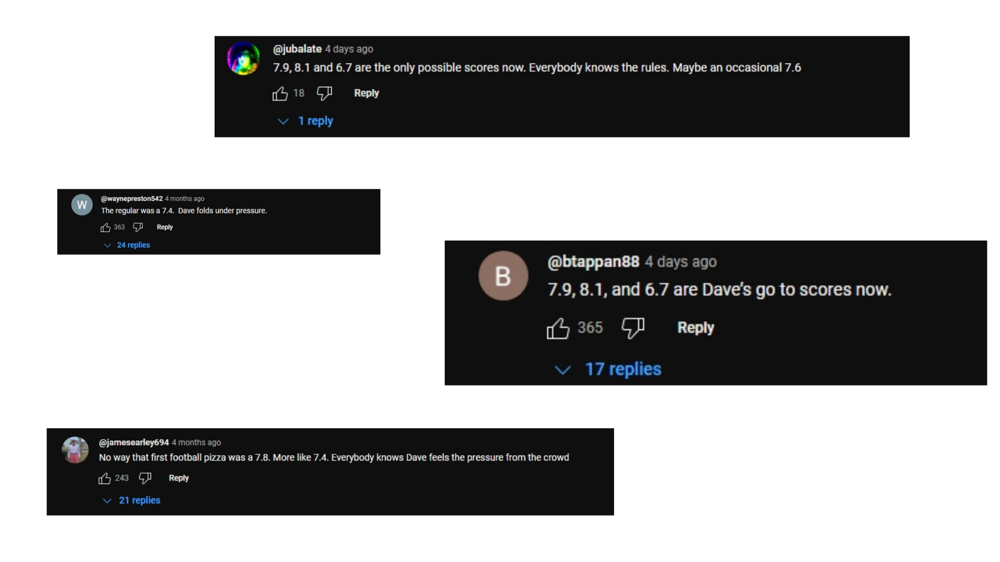
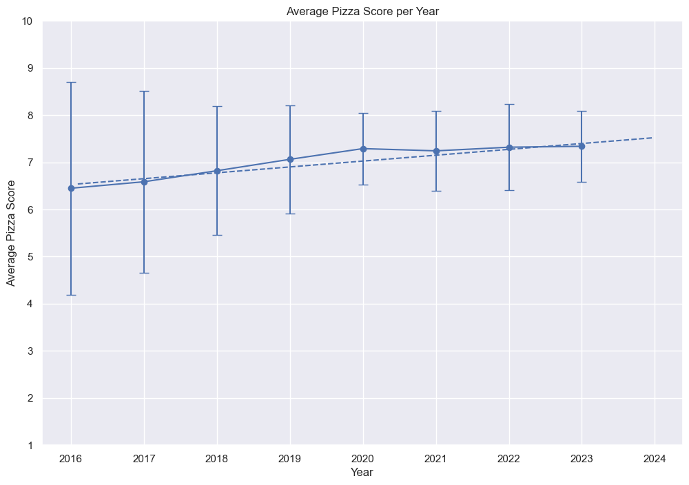
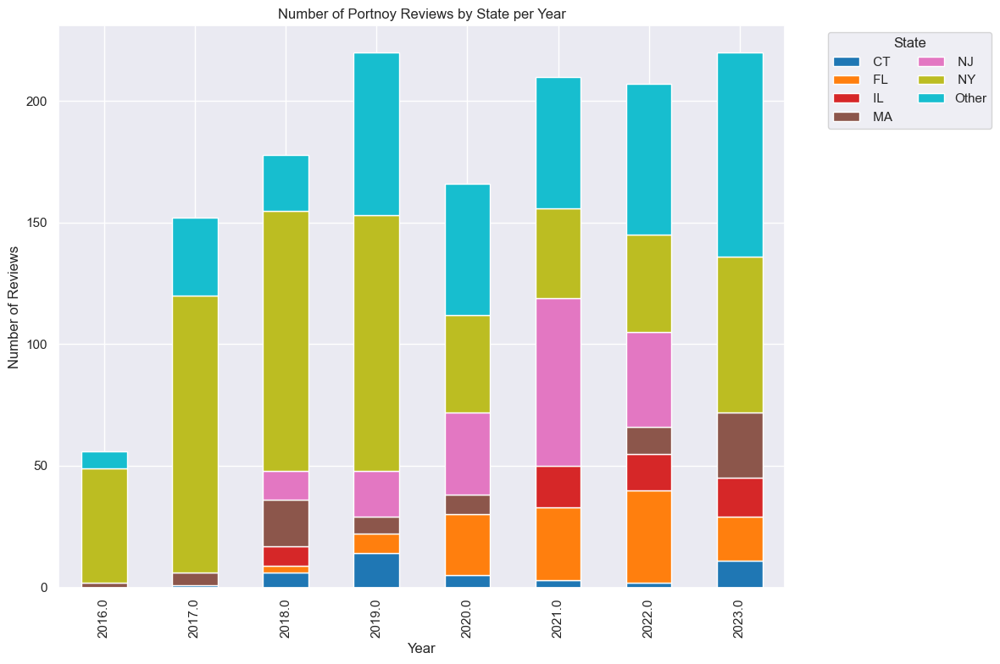
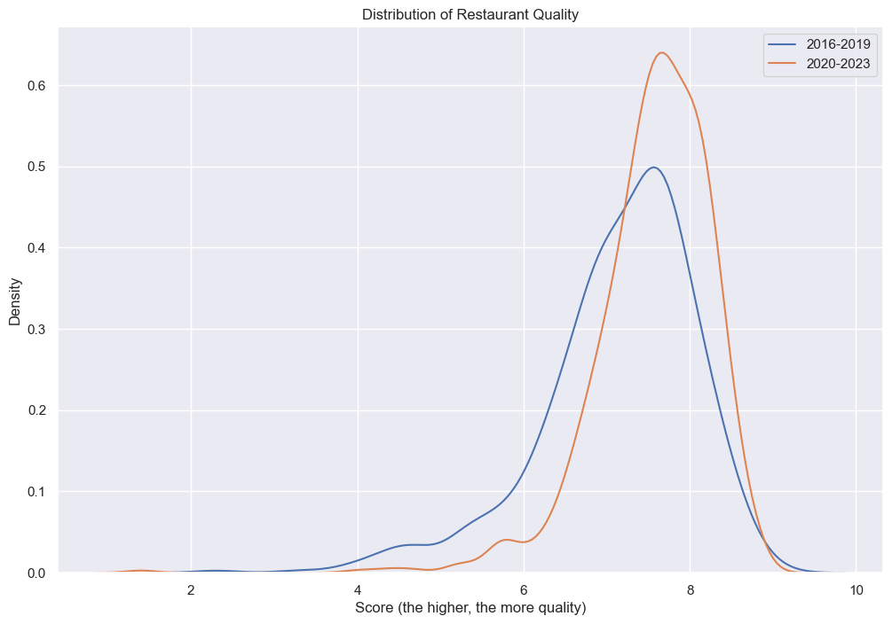
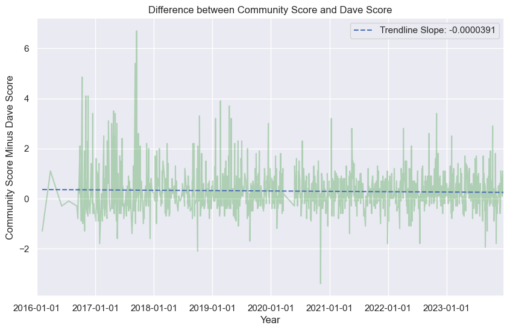

If you spend any time on the internet, then you probably have heard of Dave Portnoy. The founder of [Barstool Sports](https://www.barstoolsports.com/), he’s also a prolific pizza reviewer. Since 2013, Portnoy has reviewed nearly 2,000 pizzerias and his [videos](https://www.youtube.com/@OneBitePizzaReviews) regularly gain hundreds of thousands of views. 

Portnoy’s ‘One Bite’ reviews can also transform the fate of small businesses. Last year, Portnoy gave the obscure West Palm Beach pizzeria Ah-Beetz a “monster score” of an 8.4. Today, Ah-Beetz still sees [long lines](https://www.miaminewtimes.com/restaurants/barstool-pizza-david-portnoy-praises-ah-beetz-in-delray-beach-16639968) and is opening up [four new locations](https://ah-beetz.com/ah-beetz-locations/) to keep up with demand. 

I’m a longtime viewer of Portnoy’s reviews. The videos are entertaining and I use them to find good pizza. Recently, I’ve noticed a growing sentiment amongst the Youtube comments – Portnoy’s reviews have gone soft. Dave used to issue “real” scores back in the day. Now? He’s playing it safe and giving mostly 7’s. 

While it’s best to ignore Youtube comments, they made me curious: **has the way Portnoy scores pizza changed?**

Suppose he’s become more lenient. Today’s 7.1 is yesterday’s 6.8. For pizzeria’s with older reviews, it means they’re being unfairly compared. There could be hundreds of great restaurants being overlooked simply because their review was done years ago. 

In this article, I used the OneBite App to determine if Portnoy’s average pizza scores have changed over time. Then, I explored his scoring consistency by comparing them with the pizzeria’s OneBite Community Score.

#### Approach
Before I could start, I needed a dataset of Portnoy's scores. To my surprise, I could not find an existing dataset. So, I went to the source: the [OneBite website](https://onebite.app/reviews/dave). After reviewing the Terms & Conditions, I used a python script to collect the following information from every review:

1. Pizzeria Name
2. Address
3. Dave's Score
4. OneBite Community Score
5. Number of Community Reviews
6. Dave's Review Date

Next, I removed 2013 and 2015 reviews because those years had less than 50 reviews. I also filtered out 2024 reviews since the year hasn’t finished and I’d be comparing annual averages. Then, I added a ‘Score Difference’ which measured the difference between the Community Score and Portnoy’s Score, which I used later for comparison tests.

#### Question #1: Have Portnoy's Scores Been Getting Higher?

My first step toward answering my question was determining if Portnoy’s scores have changed over time. Plot 1 displays Portnoy’s average score per year, along with error bars. The larger the error bar, the more extreme scores there are (like 2’s and 9’s).

Indeed, Portnoy’s average score increased. The average score in 2023 was nearly 14% higher than the 2016 average score. Additionally, there’s the matter of the error bars, with a noticeable difference in their size before and after 2020. When comparing key statistics, we can clearly observe this difference:

|                   | 2016-2019 | 2020-2023 | Change (%) |
|:------------------|:---------:|:---------:|:----------:|
| Average Score     |   6.82    |    7.30   |  +7.03%    |
| Standard Deviation|   1.57    |    0.82   |  -47.77%   |
| Variance          |   2.46    |    0.68   |  -72.36%   |
| Most Common Score |   6.7     |    7.3    |  +8.96%    |

It appeared that, yes, Portnoy is scoring pizza’s differently: since 2020, he's been giving out higher and less extreme scores. 

But, the change in the error bars made me suspicious. Even considering the pandemic, I expected to see the variance returning to its pre-2020 levels by 2023. But that didn’t happen. Something is making Portnoy’s scores higher and more consistent. 

Before I could claim Portnoy had become more lenient, I needed to figure out what happened.

#### Question #2: What Affected Portnoy's Scoring?

Clearly something changed in Portnoy's scoring. I turned to his videos to see if I could find evidence of what caused this change. Over the course of a week, I watched 120 of pizza review videos, taking notes on what I observed.

The videos told an interesting story. Most reviews between 2016 and 2017 were in NYC. Occaisonally, Portnoy alluded to how he found the [spot](https://onebite.app/restaurant/norma-new-york-ny-3be6fd2e). Generally, this was via a friend, an internet comment, or sometimes it appeared like pizzeria was just along the way to where he was going. Essentially, it felt random. 

Contrast that with his reviews after 2020. New York City reviews became less common, replaced with trips to different states like Florida or areas known for their pizza. In several videos, Portnoy asked his assistant how he found the pizzeria, to which he’d often answer via the One Bite App.

I wanted to see if verify if this shift in location may have had an affect on the average. Plot 2 breaks down the reviews by their locations per year. 

Sure enough, location closely correlated with the observed shift in average score. Between 2016 and 2019, the majority of reviews were in NYC. After 2020, the share of NYC-based reviews halved and never returned. Meanwhile, other states like New Jersey and Florida saw an increase in their share of reviews.

Does this mean Florida and New Jersey have better pizza than New York? No, at least I don’t think so. Instead, I believe this is evidence of **selection bias**. 

[Selection Bias](https://sph.unc.edu/wp-content/uploads/sites/112/2015/07/nciph_ERIC13.pdf) is a type of bias caused by the way data is selected. In a perfect world, Portnoy would select pizzerias randomly to help control for factors that might influence the score. As observed in the videos, the selection process in earlier years appeared to be more random.

Today's selection process appears much less random. Based on the videos I watched, here’s how I believe Portnoy’s selection now works:

It generally begins with Portnoy taking a trip, perhaps to Florida. Dave is less familiar with these areas and, as his popularity has grown, he's become focused on trying the "best" (this is a conjecture, I don't know this for sure). So Portnoy has his assistant use the OneBite App's Community Score to find and select the area's highest rating pizzerias. Therefore, it means the score increase observed in Plot 1 isn’t from Portnoy being more lenient or 'being off his game'. Instead, it means his assistant is picking higher quality pizzerias to review. 

This assumption is supported by Plot 3, which shows the distribution of quality restaurants for 2016-2019 and 2020-2023. The recent years have a higher concentration, or density, of restaurants with a higher Community Score whereas 2016-2019 is more spread out. 

#### Question #3: So, are Portnoy's Scores Consistent?

The change in the selection process meant I needed to control for restaurant quality. By finding a benchmark independent of restaurant quality, I could measure the relative change between it and Portnoy's Pizza Score to see if his scoring has shifted over time. 

Thankfully, there was the Community Score, a composite of individual OneBite user reviews. My hypothesis was simple: if Portnoy’s scoring has been consistent, I would expect to see no change in the _difference_ between his score and the Community Score. Coversely, if his scoring _has_ become lenient (aka inflated), then I'd expect to see an increasing difference emerge over time.

Plot 4 illustrates this by showing a line plot of the score difference (in green) for each review over time. To measure the change in difference, I included a linear-fit trendline. A positive slope would indicate Portnoy is becoming more lenient, while a negative slope would suggest he is becoming more strict.

Remarkably, the trendline is essentially zero, suggesting Portnoy's scoring is consistent despite changes in selection quality.

#### Conclusion
Dave Portnoy uploaded his first pizza review in 2013. He's gone on to review close to 2,000 pizza’s across the world. And, remarkably, his scoring has been consistent. This is good news for those of us who use the OneBite App to find good pizzerias. While you may not agree with Portnoy’s taste, you can be confident that a Portnoy 7.1 from 2016 should be close to the same as one from 2023. 

Plus, we can now definitively ignore those Youtube commenters, but you probably are wiser than me and knew that already.  

#### Appendix A: Resources

- [Github](https://github.com/callahan2500/pizza)
- [One Bite Website](https://onebite.app/reviews/dave)

#### Appendix B: A Note on Community Score

