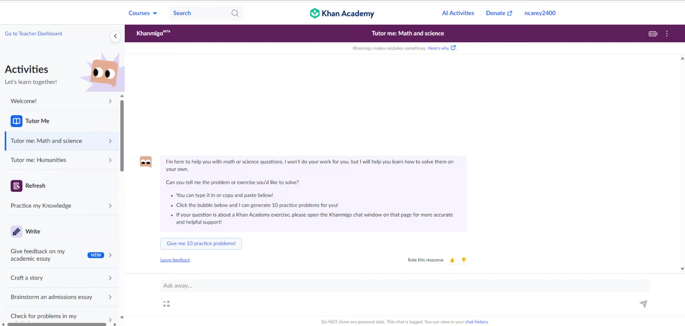

2023 was the year of the large language model (LLM) chatbot. It felt as if every product worth its salt got a chat feature (including car dealership websites). LLM as a technology is great, but I think __how__ we interact with them is not ideal. Simply providing a user with a chatbox is, as Maggie Appleton puts it, the "lazy solution"[1]. 

To unlock the potential of LLMs to radically transform a product’s user experience, we need to look beyond simply adding a chatbot to the UI and towards designing more holistic, mentor-like, experiences.

## What's wrong with LLM chatbots?

At first glance, chatbots offer a promising user experience because they enable users to interact with a digital interface conversationally, just like they would with a real person.

Historically, making chatbots seem ‘human’ was challenging because they required complex decision trees and pre-written messages to work. LLM-powered chatbots, however, now make it possible for a user to type pretty much anything into an input and receive a convincingly human reply. And as these models improve, their responses are only becoming more sophisticated. We've reached a point where people can use LLM chatbots, like ChatGPT, for web searches, learning new skills, and assisting in completing repetitive tasks.

However, LLM chatbots have a drawback — they’re reactive. Meaning, the conversation flow is driven by the user. Not only does the user have to initiate the interaction but must also guide it by writing articulate prompts and providing context. In chatbot form, the LLM’s effectiveness is directly tied to the user’s ability to articulate their needs.

Take my experience as an example. As a beginner in web development, I occasionally use ChatGPT to help me debug my code. When the error message is unclear, I sometimes struggle to come up with the right terminology to describe the problem (I don’t know what I don’t know), meaning it can take a while before I receive an output that is helpful.

In contrast, when I use ChatGPT for tasks within my expertise (like writing an email), the experience is very different. Since I know A. how to write an email and B. what I’m looking for, I can effectively frame my prompt and know what constitutes a good response.

__Knowing how to frame a prompt AND what is a good output should not be left up to the user__ because it places a lot of cognitive load on them. Ideally, products should minimize the amount of effort required by the user to complete a task. 

But what if it didn’t have to be this way? Picture future LLM products that act more like mentors — a guide who is capable of understanding your current skill level and provides proactive guidance precisely when needed, without the need for explicit user-led prompting. 

I think the road to this future lies not just in improving models, but rethinking the way engineers, designers, and product managers design LLMs into their products. 

## Creating Magic with Anticipatory Design

Great products reduce the gap between the user’s imagination and their ability to realize it. Magical products go a step further: they expand the user’s imagination by pushing the boundaries of what they believe is possible. Anticipatory design offers an approach to make that happen.

Anticipatory design is the technique of predicting and responding to user needs even before they realize they have them. It’s similar to what amazing teachers, mentors, and coaches do. Having walked the walk, they understand the needs of their ‘pupil’ and dynamically guide them accordingly with timely nudges, questions, or feedback, even if they didn’t explicitly ask. 

For a tool to be anticipatory, product designer [Joel van Bodegraven argues in his 2017 paper](https://aaai.org/papers/15352-15352-how-anticipatory-design-will-challenge-our-relationship-with-technology/)[2] that it must help the user answer the following:

- __Intent__ - What is the ideal outcome for me?                         
- __Baseline__ - Where am I currently in relation to that ideal outcome?
- __Effect__ - How do I achieve that outcome?                           
- __Scenario/Path__ - What are my options for reaching that outcome and which is best?
- __Sustainment__ - Once I reach my goal, what’s next? How can this product continue to support me?

Simply integrating an LLM chatbot into your product will not automatically answer these steps for the user. It’s unrealistic to expect a user, without proper guidance, to play with a chatbot and achieve the optimal outcome. Such an experience will likely lead to confusion, then irritation — and culminate in churn.  

So how can we leverage anticipatory design principles to build LLM products that keep the user coming back? Below I outline five key principles an anticipatory product should incorporate, alongside some explorations where I try to apply it. 

### Make your User feel like a Hero:
There’s nothing better than feeling like a hero. Therefore, building a product that evokes this feeling in your users is a surefire way to keep them coming back. 

Products that make their users feel like heroes must assist them in overcoming their challenges while ensuring they feel like their actions led to achieving the goal. Consequently, an LLM product should not just do the work for the user or keep them out of the decision-making process. Instead, make users to feel in control, while in reality, your product handles much of the heavy lifting. Achieving this balance will make your users feel empowered, precisely the feeling that will make them continue to use your product.

#### Example 1 - Literature Review LLM Assistant
Suppose you’re developing a tool for academics aimed at making it faster to complete literature reviews. Literature reviews can be time-consuming and daunting, especially for beginners.

The simplest version of this tool could be extracting text from uploaded papers and using an LLM like GPT-4 to provide a summary. However, if the final deliverable omits something important or is just inadequate, it might erode the user’s trust and lead to churn.

Let’s apply this principle to this tool so we make the user feel like a hero. First the tool needs to understand how it can make the users feel like a hero. 

The user faces two core challenges: finding and understanding academic papers. To make the user the hero, the tool must help them overcome these challenges while allowing them to make the important decisions. To achieve this, the tool could first ask them about their specific research goals or topics of interest. 

Then, acting like a proactive assistant, it retrieves a curated list of relevant papers from databases like ArXiv. To keep the user in the loop, they can select which papers to review. 

Finally, for each paper, the tool outputs a PDF with intelligently highlighted sentences coupled with an explanation of its selection process and a high-level summary. The user can fall back on a chatbot to ask the LLM questions about the paper or double-click into why they highlighted a specific sentence.

Within just a few minutes, the user has multiple annotated papers. The tool not only saved the user significant time and energy, but it also kept them involved, building trust and a sense of accomplishment, reinforcing their role as the hero.

  

    <iframe src="https://www.loom.com/embed/faaeb2979cc64e9eb183d2739d44e536?sid=6b0da82a-7f25-4bf2-8202-cfec48d422c8" frameborder="0" webkitallowfullscreen mozallowfullscreen allowfullscreen style="width: 100%; height: 300px;"></iframe>
  

  

    <iframe src="https://www.loom.com/embed/50989ca938d945b3b1e9081b4927e8c3?sid=0eef0206-3846-48d3-9f1b-bcc08189e918" frameborder="0" webkitallowfullscreen mozallowfullscreen allowfullscreen style="width: 100%; height: 300px;"></iframe>
  

 

### Embed Context-Gathering into the User Journey:
This principle requires two steps. First, take time to understand your ideal user and anticipate the potential challenges they might face as they work towards the ‘ideal outcome’. Then, within the user experience, embed data capture touchpoints to help your product adapt to the user’s specific needs and context. These touchpoints should seamlessly collect key information from the user without them needing to initiate.

#### Example 2 - LLM Math Tutor
You’re building a tutoring app for elementary students in Math. A common complaint about online learning apps from students is that they are boring and lack personalization. Furthermore, poorly designed learning apps can detract from the learning experience, leaving students distracted, doubtful of their abilities, or unsure about what to do next. The goal with this tool is to inspire confidence and meet the individual needs of the student.

Before we help the student reach this outcome, we need to measure their baseline so we can tailor the learning plan and style around their specific needs. To achieve this, we can start by first anticipating who our ideal user might be and collect research to test assumptions. This can be done through traditional means like user interviews, usability tests, etc.

However, this only gives us a general understanding of a potential user. Our aim is to make this tool as personalized as possible, so ideally, the user experience should adapt to each specific user. To capture this level of granular insights, we’ll integrate context-gathering directly into the user journey using LLMs.

My exploration, ‘LevelUp Learning’, does through a seamless and engaging onboarding process. Think of it as a calibration period for the app. Just like a human tutor, LevelUp prompts the user to try a few different problems and ask follow- up questions to gauge their skill level, gaps, and, learning style. 

On the backend, reponses are pulled together to create a unique OpenAI Assistant, tailored to the specific learning style and interests of each user. As the user progresses through future lessons, this Assistant will generate the problems, handle questions, and so on. This ensures that the user experience is as personalized as possible. Meanwhile, to the user, this seamless context-gathering occurs without them even realizing it, minimizing cognitive load.

<iframe src="https://www.loom.com/embed/251217a66f034cd283f086480e50bfc3?sid=e5464d3c-ebd3-4f4e-86d4-e504e006c426" frameborder="0" webkitallowfullscreen mozallowfullscreen allowfullscreen style="position: absolute; top: 0; left: 0; width: 100%; height: 100%;"></iframe>

### Proactively Engage your User:
Don’t wait for users to make the first move. Use LLMs to actively offer suggestions, recommendations, etc. at key moments in the user journey. This proactive approach can assist users when they are stuck, helping them achieve breakthroughs, or those “aha” moments.

#### Example 3 - An LLM People Connector
Malcolm Gladwell posits there are three types of people who make change happen: Mavens, Connectors, and Salespeople. Connectors are individual who know a lot of people and can, therefore, bring together groups of different people.

Imagine having a personal Connector by your side who knows your networking goals and recommends whom you should connect with and why. All you would have to do is set a target goal like, “help me connect with 500 people in the VC space” and the Connector would get right to work identifying the right people and putting you in contact with them. 

This product, good news, is being born into existence by my friend Devin Keane over at Rolotech (you can check out his platform here). But for this example, let’s envision it having a browser extension feature and use our third principle to design an experience that requires minimal user initiative. 

Drawing inspiration from tools like Honey, which searches the internet for promo codes on Amazon, our envisioned LLM Connector tool performs a similar role on sites like LinkedIn, Facebook, and even news sites. When you visit a page, the Connector scours the text, searching for names and potential contacts. It then gathers additional information about these contacts from the web and checks their relevance against your networking goals. 

If a match is found, the Connector either alerts you with a notification or, if you've moved on from the page, sends an email. The user can then choose from actions like saving the contact, directly connecting with them, or receiving a strategy on how to engage. 

If the user chooses to have the Connector reach out on their behalf, it crafts and sends an email using the scraped information. 

Alternatively, if the user selects the strategy option, the Connector provides a detailed guide on the most effective approach for personal outreach.

<iframe src="https://www.loom.com/embed/66f9c5db38ba4d67a62bd6f53b6cdfd5?sid=325b58f7-330d-4b53-9c18-5b386a308c04" frameborder="0" webkitallowfullscreen mozallowfullscreen allowfullscreen style="position: absolute; top: 0; left: 0; width: 100%; height: 100%;"></iframe>

### Add Feedback Loops:
Ensure users can easily provide feedback when the LLM isn’t meeting their needs. There should always be a straightforward way users can offer specific feedback. As you design your user experience, think about the best way to capture that feedback.

While I don’t have a wireframe example, I do have a real-world example. Take Khanmigo, the tutoring chatbot from Khan Academy. Users looking to provide feedback can do so effortlessly by selecting “Leave Feedback” beneath every Khanmigo message. What I like about this feature is that the feedback modal is structured. This offers clear guidance to the user and also streamlines the process for efficiently collecting and analyzing the data.

### Positively Surprise your User:
Finally, a positive, well-timed surprise can significantly enhance the user’s emotional connection with the product. To achieve this, list out the problems your ideal user might face along their journey. Then, brainstorm how your LLM might offer a novel way to overcome the problem. That might be with a well-timed recommendation, insight, or deliverable like text or an image. 

*This essay was inspiried by the following works. I can't recommend them enough! Also, special thanks to Tony Chedrawee for reviewing and helping me meet my self-imposed deadline.*

1. [_"Language Model Sketchbook, or Why I Hate Chatbots" by Maggie Appleton_](https://maggieappleton.com/lm-sketchbook)
2. [_"The Biggest Bottleneck for Large Language Model Startups is UX" by Davis Treybig_](https://medium.com/innovationendeavors/the-biggest-bottleneck-for-large-language-model-startups-is-ux-ef4500e4e786)
3. [_"Generative Interfaces Beyond Chat"by Linus Lee_](https://www.youtube.com/watch?v=rd-J3hmycQs)
4. [_"Designing for AI: Beyond the chatbot" by Ridhima Gupta_](https://uxdesign.cc/designing-for-ai-beyond-the-chatbot-5edc0efe84a3)
5. [_"How Anticipatory Design will Challenge Our Relationship with Technology" by Joel van Bodegraven_](https://aaai.org/papers/15352-15352-how-anticipatory-design-will-challenge-our-relationship-with-technology/)
6. [_"How not to add AI to your product"_](https://www.fillout.com/blog/how-not-to-add-ai-to-your-product)

