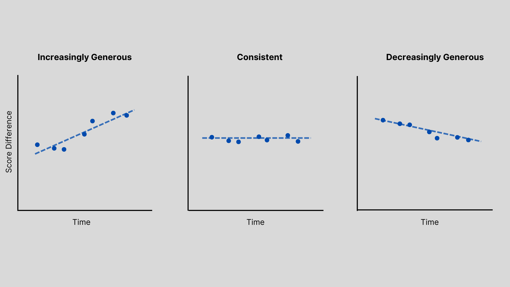

If you spend any time on the internet, you probably have heard of Dave Portnoy. The founder of [Barstool Sports](https://www.barstoolsports.com/), he’s also a prolific pizza reviewer. Since 2013, Portnoy has reviewed nearly 2,000 pizzerias and his [videos](https://www.youtube.com/@OneBitePizzaReviews) regularly gain hundreds of thousands of views. 

Portnoy’s ‘One Bite’ reviews can also transform the fate of small businesses. Last year, Portnoy gave the obscure West Palm Beach pizzeria Ah-Beetz a “monster score” of an 8.4. Today, Ah-Beetz still sees [long lines](https://www.miaminewtimes.com/restaurants/barstool-pizza-david-portnoy-praises-ah-beetz-in-delray-beach-16639968) and is opening [four new locations](https://ah-beetz.com/ah-beetz-locations/) to keep up with demand. 

I’m a longtime viewer of Portnoy’s reviews. The videos are entertaining and I use them to find good pizza. Recently, I’ve noticed a growing sentiment amongst the Youtube comments – Portnoy’s scores have gotten higher. Dave used to issue “real” scores back in the day. Now? He’s a lot more generous and giving mostly 7’s. 

While it’s best to ignore Youtube comments, they made me curious: _**has the way Portnoy scores pizza changed?**_

Suppose his scores have become more generous. Today’s 7.1 is yesterday’s 6.8. For pizzerias with older reviews, it means they’re being unfairly compared. There could be hundreds of great restaurants being overlooked simply because their review was done years ago. 

In this article, I analyzed Portnoy's scoring consistency to determine whether his scores had become more generous.

### Collecting the data
Before I could start, I needed his scores. To my surprise, I could not find an existing dataset. So, I went to the source: the [OneBite website](https://onebite.app/reviews/dave). After reviewing the Terms & Conditions, I used a Python script to collect the following information for every review:

1. Pizzeria Name
2. Address
3. Portnoy's Score
4. OneBite Community Score
5. Number of Community Reviews
6. Dave's Review Date

Once I had this dataset, I removed reviews from 2013 through 2015 and 2024 because they had less than 50 reviews or were an incomplete year. Then, I added a ‘Score Difference’ column which measured the difference between the Community Score and Portnoy’s Score.

### Are Portnoy's scores getting higher?
My first step was determining if Portnoy’s scores changed over time. Plot 1 displays Portnoy’s average score per year, along with error bars. The larger the error bar, the more frequent extreme values, like 2's or 9's, occurred that year. 

Indeed, Portnoy’s average score increased. The average score in 2023 was nearly 14% higher than the 2016 average score. Additionally, there was a noticeable difference in error bar's length before and after 2020. When comparing key statistics, the post-2020 shift became clear:

|                   | 2016-2019 | 2020-2023 | Change (%) |
|:------------------|:---------:|:---------:|:----------:|
| Average Score     |   6.82    |    7.30   |  +7.03%    |
| Standard Deviation|   1.57    |    0.82   |  -47.77%   |
| Variance          |   2.46    |    0.68   |  -72.36%   |
| Most Common Score |   6.7     |    7.3    |  +8.96%    |

It appeared that, yes, Portnoy was scoring pizzas differently: since 2020, he'd been giving out higher and less extreme (variable) scores. Case closed?

Not so fast. The shift in score variability made me suspicious. Even considering the pandemic, I expected to see the variance return to its pre-2020 level by 2023. But that didn’t happen. Something was making Portnoy’s scores higher and less extreme. 

Before I could claim Portnoy's scores had become more generous, I needed to figure out what was causing this shift.

### What caused Portnoy's scoring shift?

I started by watching his videos to find evidence of the shift's cause. Over the course of a week, I watched 120 reviews and took notes on what I observed.

The videos told an interesting story. Most reviews between 2016 and 2017 were located in NYC. Occasionally, Portnoy alluded to how he found the [spot](https://onebite.app/restaurant/norma-new-york-ny-3be6fd2e). Generally, this was via a friend, an internet comment, or sometimes it appeared like the pizzeria was just along the way to where he was going. Essentially, it felt random. 

Contrast that with his post-2020 reviews. New York City reviews became less common, replaced with trips to different states like Florida or areas known for their pizza like Connecticut. In several videos, Portnoy would ask his assistant how he found the pizzeria, to which he’d often answer it was through the One Bite App.

I wanted to verify if this shift in review location may have affected the average score. Plot 2 breaks down reviews by their locations per year. 

Sure enough, review location closely correlated with the observed shift in average score. Between 2016 and 2019, the majority of reviews were in NYC. After 2020, the share of NYC-based reviews halved. Meanwhile, states like Florida and New Jersey saw increases in their share of reviews.

Does this mean Florida and New Jersey have better pizza than New York? No, at least I don’t think so. Instead, I believe this is evidence of **selection bias**. 

[Selection Bias](https://sph.unc.edu/wp-content/uploads/sites/112/2015/07/nciph_ERIC13.pdf) is a type of bias caused by the way data is selected. In a perfect world, Portnoy would select pizzerias randomly to help control for factors that might influence the score. As observed in the videos, the selection process in earlier years appeared to be more random than today's. Based on the videos I watched, here’s how I believe Portnoy’s selection currently works:

It generally begins with Portnoy taking a trip, perhaps to Florida or Nantucket. Dave may be less familiar with the pizza options in these areas and, as his popularity has grown, wants to focus on trying only the "best" places. So Portnoy tasks his assistant to use the OneBite App and select the area's pizzerias with the highest Community Score. Therefore, the score increase observed in Plot 1 isn’t necessarily from Portnoy being more generous or 'being off his game'. Instead, his assistant is picking more highly rated pizzerias. 

This assumption is supported by Plot 3, which plots the distribution of pizzeria Community Scores for 2016-2019 and 2020-2023. The post-2020 period had a higher concentration, or density, of restaurants with a higher Community Score whereas 2016-2019 had less and was more spread out. 

### So, are Portnoy's Scores consistent?

With the selection bias appearing to affect the average, I couldn't rely on the it to determine if Portnoy's scoring had become more generous. To detect this, I needed to compare his scores with a consistent benchmark. Thankfully, there was the Community Score. The Community Score aggregated multiple individual scores taken overtime into one average. Therefore, the effect of an individual's biases are lessened, providing a good enough benchmark. 

I could compare the Community Score with its Portnoy Score using the Score Difference. If Portnoy's scoring had remained consistent over time, I would expect no change in the Score Difference. However, if he had become more generous over time, then I should see the difference steadily increasing. 

Plot 4 shows a line plot of the score difference for each review. To measure changes in the Score Difference, I included a trendline. A positive slope would indicate Portnoy is becoming more generous, while a negative slope would suggest he is becoming less so.

The trendline is effectively flat, hovering around Score Difference of 0.50. This flat slope suggests Portnoy's scoring is remarkably consistent, despite changes in how pizzerias are selected.

### Conclusion
Dave Portnoy has been reviewing pizza almost every day since 2013. In this analysis, I showed that perceived increases in Portnoy's scoring likely stemmed from the way he and his team picked spots to review, not due to Portnoy becoming more generous with his scores. In fact, Portnoy's Scores demonstrated impressive consistency over time when compared with the Community Scores. 

This is good news for OneBite users and pizzerias alike. While you may not agree with Portnoy’s taste, you can be more confident that a Portnoy 7.1 pizza reviewed in 2016 should be comparable to a 7.1 reviewed in 2023.   

#### Appendix A: Resources

- [Github](https://github.com/callahan2500/pizza)
- [One Bite Website](https://onebite.app/reviews/dave)

#### Appendix B: Community Score Note
In this analysis, I used the Community Score as a benchmark. You might be asking, "well, what if the Community Score had also become more generous over time"? You'd be right to ask that question. This analysis assumes Community Scores remained intrinsically consistent and had not become more generous over time. Here are two reasons that I believe justify this assumption:

1. Composite Nature: The Community Score is an average of multiple individual scores. This helps reduce the influence or bias of any specific individual.
2. Temporal Spread: The individual scores that make up the Community Score are spread out over time. This helps control for changes in the restaurant's quality.

#### Appendix C: Stats stuff for nerds
I made a few decisions in this analysis that I'd like to explain for those of you interested in my approach.

1. Error Bars: In Plot 1, I opted to use standard deviation to create my error bars instead of standard error because I wanted to emphasize the variability in pizza scores.
2. Mean instead of Median: Median can sometimes be a better descriptive statistic than mean because it is less affected by outliers. However, just like the error bars, I wanted to demonstrate that the score data was highly variable and the Mean plot made that more obvious. Additionally, people are more likely to intuitively understand what the mean is and I wanted to ensure someone without a statistics background could understand the findings.
3. Yearly Mean v. Monthly: Plot 1 measured the annual mean. I decided to use Year as the aggregate to keep the plot clean. A quick note - during my preliminary analysis I observed some interesting seasonality affects on the monthly mean, so maybe one day I'll do a followup analysis.
4. Sampling: My analysis measured 1,410 reviews. This was less than the 1,737 reviews Dave had completed by the time I pulled the data (7/22/2024). The difference is mostly from the removal of 2013-2015 and 2024 reviews, but my web-scraper did miss approximately 10% of reviews. This was due to how the scraper navigated the website. The scraper would search through each 'fan favorites' page, where it would search for pizzeria's that had both a Portnoy and a Community Score. Since I couldn't rank pizzerias by whether they had both scores, the scraper had to iterate through the thousands of pages. This took forever and had diminishing returns as the later pages had fewer pizzerias that fit my criteria. So, I stopped the scraping once I hit 90% of all reviews.

