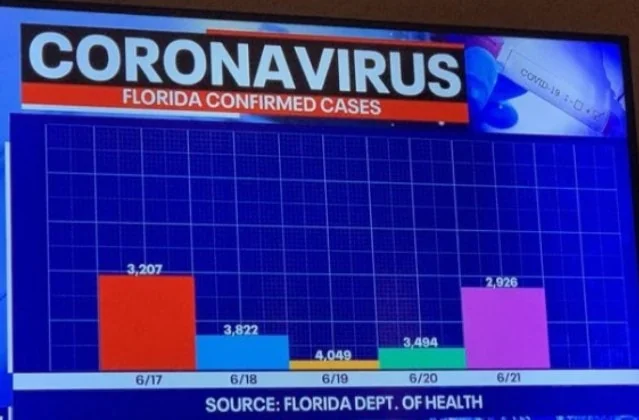
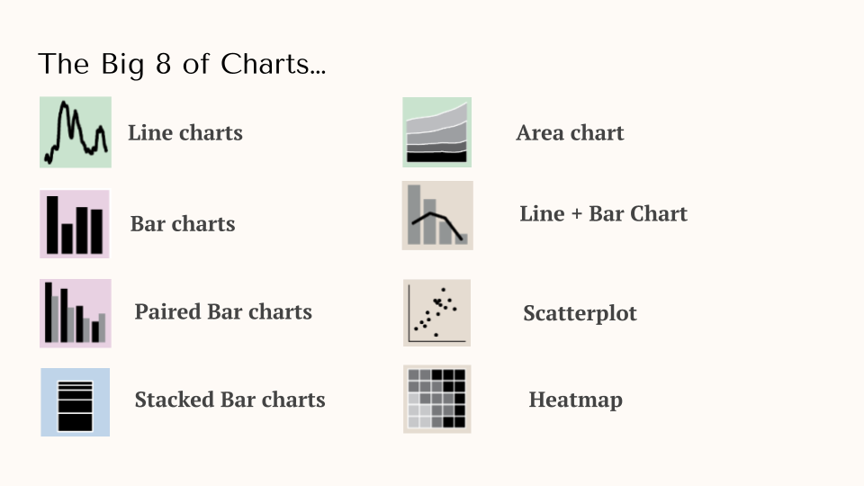

When I say the word "data", what comes to mind? For some this might be some sort of table, full of columns, rows, and values. Others (like myself) might immediately think of some sort of chart -- like a bar chart. A central way people interact with data is by visualizing it. Therefore, as someone working with data, it is crucial to consider the best way to present it. 

I think everyone has a rough sense of how to visualize data -- but __effectively__ visualizing data to tell the story you want to tell is another story. This guide provides some tips and tricks I use to visualize data -- plus a guide for when you might want to use certain types of charts.

## Look at this graph
Before we begin, let's look at an example of a bad chart. I found this beauty a few months ago while browsing Reddit. 

Right off the bat, it's clear this chart has problems. To name a few:
- No y-axis
- The labels don't match the bar size
- The colors provide no value
- From an interpretability perspective, I have no idea whether this is good or bad. Is 3K a lot? A little?

Ultimately this chart is obviously, laughably, bad. But this represents the issue: **bad charts make views confused, meaning they don't convey your message**. In the end, they are bad stories. 

If you work with data in any capacity, you want your visualizations to tell **good stories**. If your chart doesn't do this, you run the risk of your viewer at minimum not gettign the point. At worst, it erodes their trust OR the worst case is they get an incorrect interpretation. 

So let's explore how some principles you can use to tell good stories. 

## Step 1 - Write out your story!
Before you even fire up your data visualization tool, I recommend you start by writing out the story you want to tell. This is the framework I like to use:

> I want to visualize the [**situation**] of [**data**] to understand [**insight**].

Here's an example:

> I want to visualize the **change-over-time** of **COVID-19 cases** to understand whether began to decline after the introduction of vaccines.

## Step 2 - Organize your data

It might seem counterintuitive, but I place organizing your data after defining your story. This is because the story you want to tell will dictate the type of data you need. In our example above, I need:

- Time series data
- A count of COVID-19 cases
- When the vaccine was introduced

I now have a defined data structure -- making it much easier for me to go out and try and find/clean this data. 

## Step 3 - Select your chart type and build the chart

Now that I've collected my data, I need to figure out the right type of visualization. While there are MANY different types of visualizations, I'd like to introduce 8 key types and the different use cases you might use them for:

### The Big 8 of Charts and when to use them

There are certain situations when you might want to use a particular chart. Let's dig into each common use-case:

#### Change over Time
Changes over time is a very common use-case. You see this everywhere (changes in stock price, customer growth, etc).
Line charts can display how values continuously changes over a certain period of time. Choosing the right time-frame is crucial to provide the right context. Sometimes, you might want to use a different chart when visualizing change over-time: 
- Discrete Interval Values: Bar chart
- Cumulative/Proportions: Area chart
- Combination: Bar chart + Line

#### Magnitude or Rank
Magnitude refers to the total amount of something. Use a bar chart when you’re looking to compare the size of values. This is helpful when you’re comparing categories. For ranks (e/g cities with the most customers), it’s often better to use a horizontal bar chart because it’s easier to read the categories. 

A grouped bar plot can be helpful when comparing subcategories within different groups. When you care about comparing sizes…use this, **not a stacked bar**! Stacked bars make it hard to compare across different groups. 

#### Part-to-Whole Comparisons
Parts-to-whole is when you want to understand the breakdown of a larger category. For this use-case, a stacked Bar Charts can be useful, but be careful! They can quickly get messy if there are too many elements.

Another way to visualize parts-to-whole is through percents. Do this when you care about the relation, not the absolute values. You could use a 100% stacked bar chart, but a better approach in my opinion is a percent-of-total line chart. 

#### Associations
A scatterplot is a great way to visualize the relationship between two or more variables (1 per axis). Trend lines can be a useful addition to reinforce the association. Be mindful that your audience will often, subconsciously, interpret correlations as causal.

There are several other ways to visualize association. For example, a heatmap is helpful when you have aggregated (or binned) data, or too many data points. 

#### Distributions
Use a histogram when you want to show values in a dataset and how often they occur. The shape of a distribution can highlight the uniformity (or lack thereof) within the dataset.

#### Don't forget about tables...

## Step 4 - Apply design principles to communicate your story
Leverage color intentionally:
- Color can be your friend…use it as a storytelling tool.
- Use a consistent color scheme.
- Avoid using too many colors!

Select the appropriate chart settings
- Select the best scale, axis increments, and legend.

Add useful context/framing
- “When you supply a reference/benchmark, you control the message.” – WSJ
- Where applicable, add a trendline or maybe a comparison (year-over-year, total population, etc).

Annotate insights (when applicable)
- Consider including an annotation (text, arrows) to point out trends, outliers, etc.
- Use a descriptive title (Signups increased 5% WoW)

## Let's do an example

## Resources/Appendix