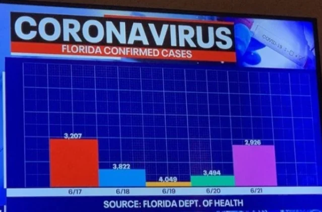
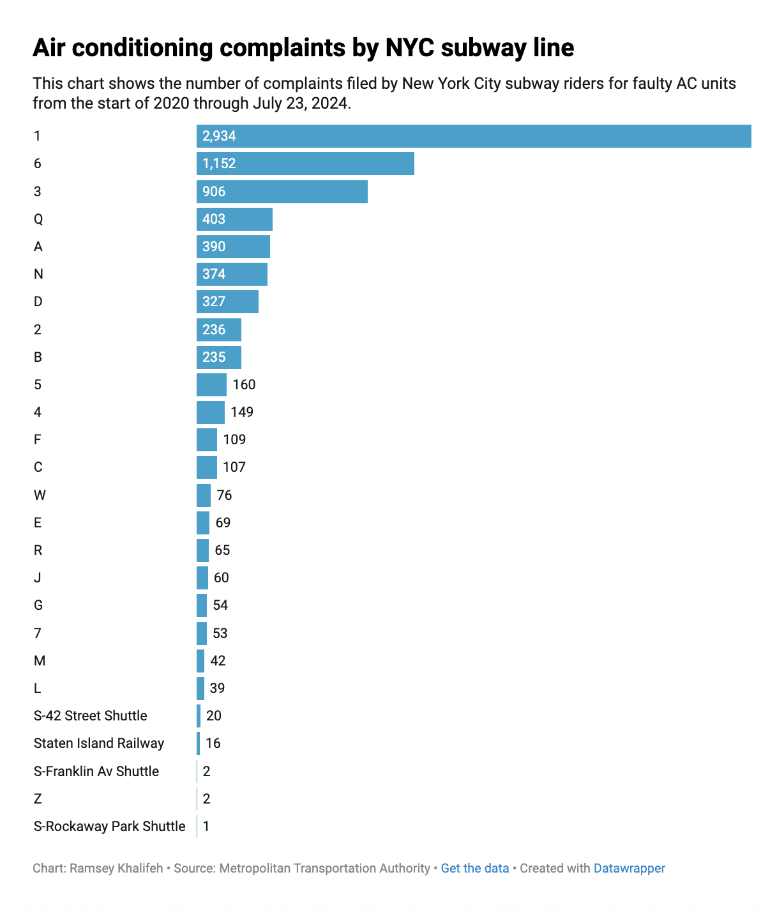
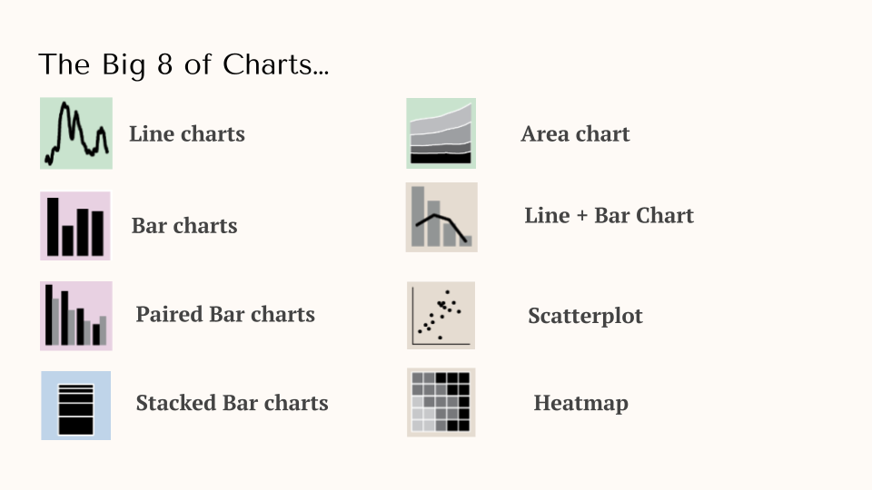
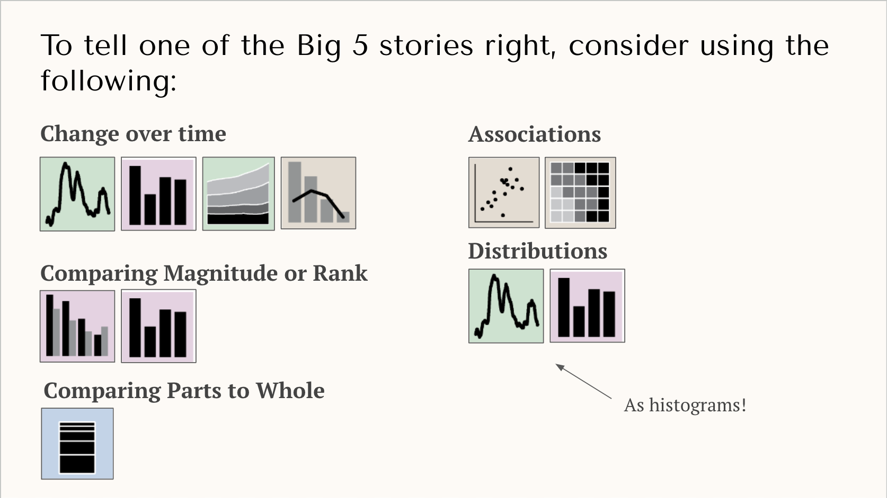
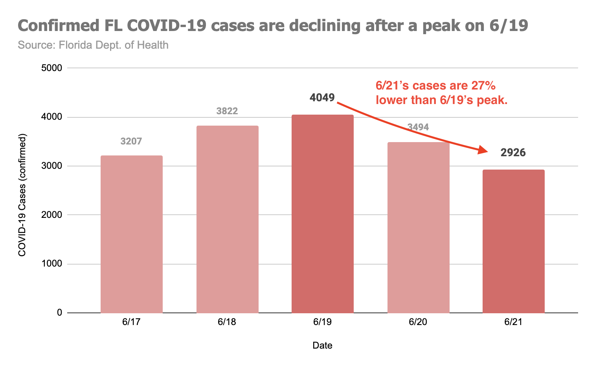

What comes to mind when you hear the word "data"? Perhaps it's a table with columns, rows, and values. Maybe it's a chart with a line moving up and down over time. I think everyone has some sense of how data can be displayed -- but visualizing data to tell an effective story is less straightforward. 

There's a wide gap between a simple chart and one that conveys a story with meaning and purpose. The goal of this guide is to help you -- whether you're a data beginner or master -- learn how to create compelling stories with visualized data.

## Look at these graphs
Let's start with an example that not only fails to tell a story, but is also a terrible chart: 

At first it might seem like a generic chart, one you'd expect to see on TV. But take a couple of seconds to really scan it. Notice anything weird?
- There is no y-axis.
- The labels don't match the bar size
- The colors provide no value
- I have zero idea what this chart is trying to tell me, what's the story?

The point of this example is not to highlight its design flaws, but to ask how this chart makes you feel. Do you feel confused? Frustrated? Do you trust this source? 

When I first saw this chart, I became so confused by its flaws I forgot what I was supposed to be looking at. Certainly, whatever story the author was trying to convery was not received!

Remember: **bad charts make viewers confused, meaning they will NEVER understand the story you're trying to tell.** 

Ultimately, we want our charts to clearly tell a story that would otherwise be less compelling to write. If your chart doesn't do this, viewers will get confused and disengage. At worst, it will begin to erode their trust in you. 

## Step 1 - Write your story!
When it comes to creating a story-driven visualization, the first step is determining the type of story you want to tell. When working with data, the stories you'll find yourself telling often come in repeated form. I've encountered five common types of 'data' stories, which I call the "Big 5".

### Change over Time
When visualizing a change over time story, you're focusing on how some value changed relative to time. For example, your company's marketing team recently changed their instagram ads and. As their marketing analyst, you're determined to know whether this had an effect on signups. Explaining how signup performance increased/decreased/stayed the same _after_ the new ads were launched is a classic change over time story. If your story revolves around a "and then...", you're telling a change over time story. 

### Comparing Magnitude or Rank
These stories involve comparing "things" to make a claim that one (or several) are better or worse than the others. Recently, I was reading an [article](https://gothamist.com/news/mta-data-reveals-how-nycs-hottest-subway-cars-bake-1-train-riders) about air conditioning problems on the NYC Subway. The author discovered the 1 train has an unusually high number of complaints relative. To make this clear, the author ranked all of the subway lines by their number of complaints, illustrating the magnitutde of AC related complaints on the 1 train were disproportionately high. If your story involves ranking, you're telling a comparing magnitude or rank story.

### Comparing Parts-to-Whole
When you want to call attention to the composition of something, you're telling a comparing parts-to-whole story. A classic example of this is survey results (e/g 40% of respondents said pancakes are better than waffles). Another example might be a budget (this is ridiculous, $100K of our $1.2M budget is going towards Nick's pizza nights?!). If your story involves explaining what one thing is made of and why it's important, you're telling a comparing parts-to-whole story.

### Associations
Association (or correlation) stories are about demonstrating a relationship between two variables. For example, perhaps you're an analyst at a coffee company. You noticed when the outside temperature reaches 63F, iced-coffee sales suddenly spike 12%. In this situation, you have two variables, iced-coffee sales and the temperature, and want to visualize their association to point out a relationship that is worth paying attention to. If your story seeks to relate two variables together, you're telling an association story.

### Distributions
"What does a typical customer do?" is a common question, one that can be answered with a distribution story. Typically (;)) 
Distribution stories tell us how dispersed a particular metric or value is over a population. A great example of this might be purchases per user on a commerce app. Here, it's likely a very small percentage of users have a significantly high amount of purchases, slowly tailing out. Distributions stories can help us understand what "typical" might be. 

---
Once you've identified the type of story you want to tell, the next step is writing it out. This will give you a clear sense of direction when building your chart. When I write my stories, I like to use this template:

> I want to visualize to [**audience**] the [**situation**] of [**data/metric**] to illustrate [**insight**].

I use this template because it distills everything I need to build a story-driven chart. First, it helps me decide my audience, which will help me determine how complex I need to make my chart. Next it spells out the situation I want my chart to illustrate to clearly visualize my single insight. 

Let's try it out using the previous Subway example: I'm writing an article for New Yorkers (audience) to show the 1 train cars have bad AC (situation) according to the line's volume of complaints (data), demonstrating complaints are coming from a concentrate number of outdated cars (insights) Using my template, the sentence would be:

> I want to visualize to my readers the 1 train has the highest of AC related complaints to convey most AC complaints are concentrated to just a few old subway cars on a single line.

## Step 2 - Prepare your data for visualization

Your story will dictate the data you need. If I wanted to visualuze my story, I'd need a dataset of complaints made grouped by subway line. I'd also need to filter these complaints to only be AC-related and figure out what the right period of time should be (the last three months, six, tweleve?).

I'd like to point out this is about preparing your data for visualization. By this point, you've likely done a lot of data analysis, which would've helped you arrive at your story. Think of that as a Step 0. 

## Step 3 - Select and build your chart

Now that we've written our story and prepared our data, we need to pick the right type of visualization. There are countless ways to visualize data, but I find these are the most common types:

I'm not going to spend a lot of time defining these OR how to actually construct them. [There are plenty of resources on this.](https://www.storytellingwithdata.com/chart-guide) What's important is that **certain charts correspond to certain data stories!** Let's use our MTA example as an example. Given this is a comparing magnitude or rank story, which of these big 8 make sense to use? 

To determine this, I've created the diagram below -- which groups each visualization type by data story. For comparing magnitudue or rank stories, we have a couple of options:

- Bar Chart
- Paired Bar Chart

Since we don't have two types of values (we're just dealing with complaints), it doesn't make sense to use a paired bar-chart. We'd normally use that when comparing two values (e/g complaints AND confirmed broken AC units). So we're left with a bar chart. Bar charts are great for comparing numerical values, like number of complaints, because we can clearly compare their sizes. 

## Step 4 - Plus up your chart with these design principles
It would be very easy to go into Excel and create a chart, but we're still not done. Default chart settings return very simplistic charts that with much to be desired. With a few design principles, however, you can make your chart better convey your story. 

Let's return to the bad COVID-19 chart at the beginning. Using Google Sheets, I redesigned it to tell the following story:

> I want to visualize to TV viewers the decline in daily, Florida COVID-19 cases to show they have decreased significantly since the 6/19 peak. 

Notice that story is immediately clear to viewers. I bet your eyes immediately focused on the two dark red bars and then the arrow with the annotation, which succinctly articulates the situation and insight. 

When redesigning the chart, I used these four techniques:

1. **Don't overcrowd your chart:** Readers' eyes wander if you let them, so your chart must guide them to what you want them to see. To do this, keep it as simple as possible. In my new chart, I could've added a trendline, maybe error bars, or maybe another line series from another state. But these would've given the reader more to interpret without adding anything to the story I'm trying to tell. _If something on your chart doesn't add to your story, delete it!_
2. **Use color with intentionality:** Color is one of your most powerful tools when building a chart. Viewer's eyes will focus on stronger, higher contrast colors first. If you want a specific datapoint to standout, consider coloring them with strong, bold colors. For non-essentials datapoints, make them lighter so they blend into the background. In my new chart, I lightened the days that didn't tell my story, allowing the important days to stand out. 
3. **Select the appriopriate chart settings:** Details matter. Ensure you have well sized axes, a legend, and labels. You don't always need these, again if they don't service your story, consider deleting them. However, in general, it is good to include well labeled axes and a legend if you have multiple series. 
4. **Use action titles and annotations for added context:** In school I learned chart titles should be "Y-axis versus X-axis", but this produces boring titles. Instead, use an action title. A good action title is your insight, written succinctly. For additional context, you might also want to add annotations directly onto the chart. Arrows help keep the eyes focused on what you want the reader to care about.

## Story + Chart = Impact
It's never been easier to build charts, but a chart without a story is just data. Ultimately, if your chart doesn't clearly convey a story, then it's a waste of your and your peers' time. 

If there is one thing you take away from this guide, I hope it's that _charts themselves are not a be-all-end-all; they're a tool to tell a good story._ Taking the time to properly identify the story you want to tell and applying some design techniques to make that story stand out will greatly increase the changes your peers understand your story, increasing your impact. 

## Resources/Appendix

- **Never use a Pie Chart:** This [article](https://www.storytellingwithdata.com/blog/2011/07/death-to-pie-charts) puts it well. Just say no!
- **Financial Times Visual Vocabulary:** This [github repo](https://github.com/Financial-Times/chart-doctor/blob/main/visual-vocabulary/poster.png) contains a useful infographic of all sorts of visualization methods FT uses. 